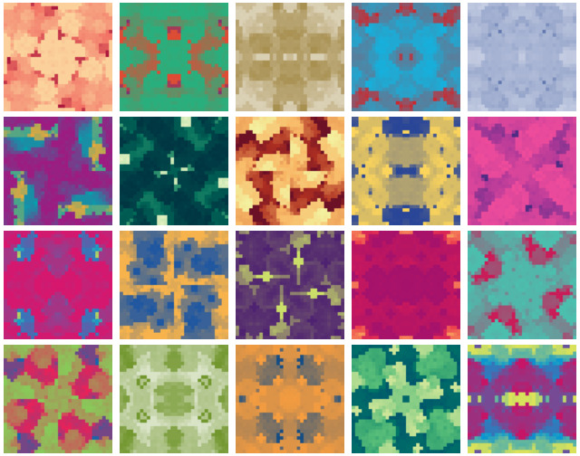
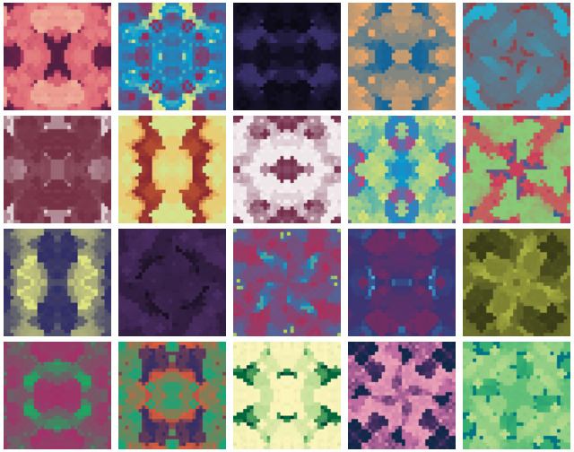
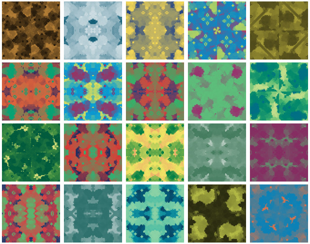
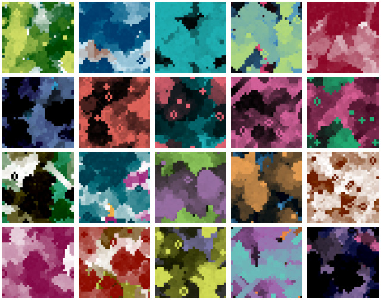
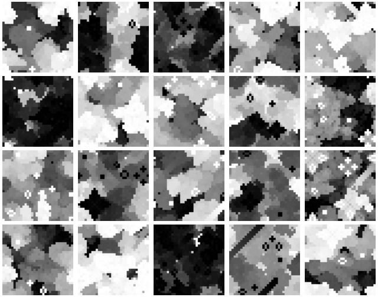

# lifehash-vue
Wrapper component for [LifeHash](https://github.com/BlockchainCommons/lifehash.info) powered [identicons](https://en.wikipedia.org/wiki/Identicon) in Vue.js


## Installation
```
npm i lifehash-vue --save
```

## Usage
The default export is a Vue component that can be used in a Vue template.
```vue
<template>
  <div>
    <LifeHash input="Hello World!" />
  </div>
</template>

<script setup>
import LifeHash from 'lifehash-vue';
</script>
```
See the demo directory for working example.

### Props
Following props are available:

| Name | Type | Description |
| ---- | ---- | ----------- |
| input | String | The input string to hash |
| version | Number | The version of LifeHash to use (Default: 1) |

### Live Example
See the demo directory for a working example implementation.

## Example results
| Version | Description           | Samples                                |
|---------|-----------------------|---------------------------------------|
| 0       | Version 1             |            | 
| 1       | Version 2             |            | 
| 2       | Version 2 - Detailed  |            | 
| 3       | Fiducial              |            | 
| 4       | Fiducial - Monochrome |  |